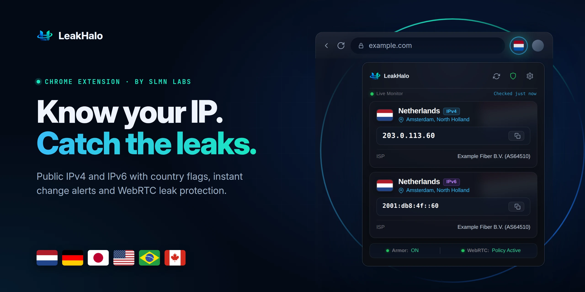
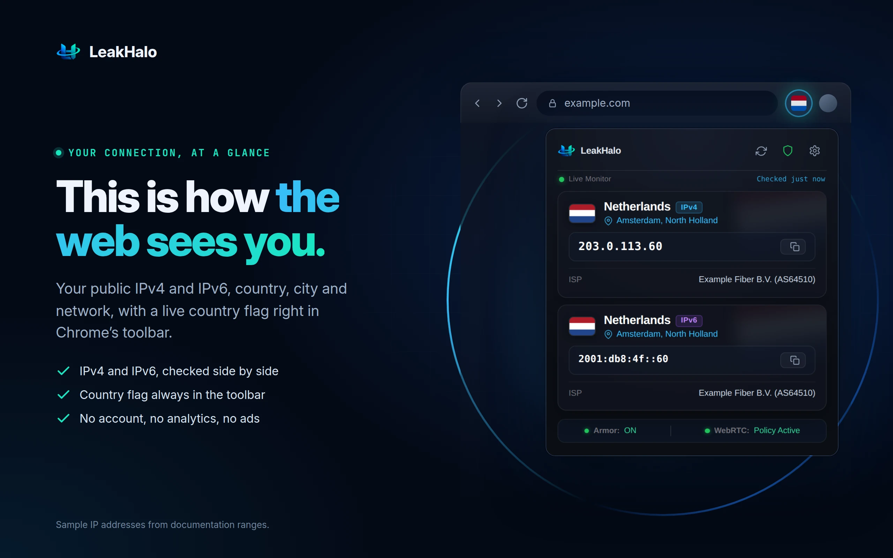
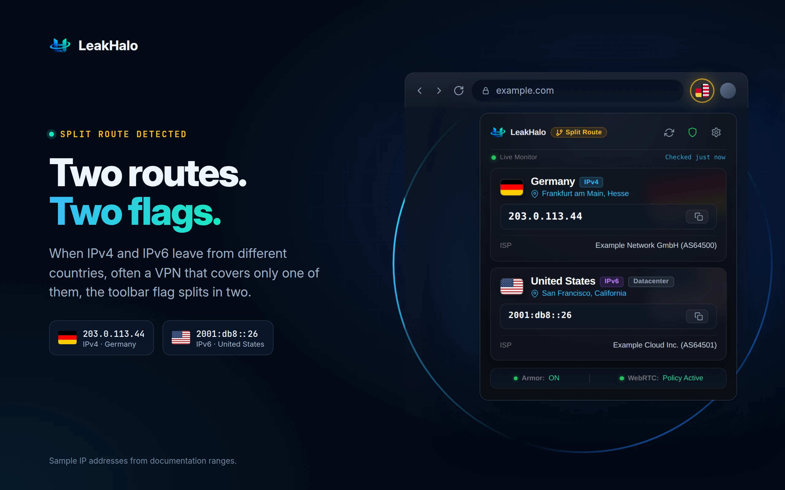
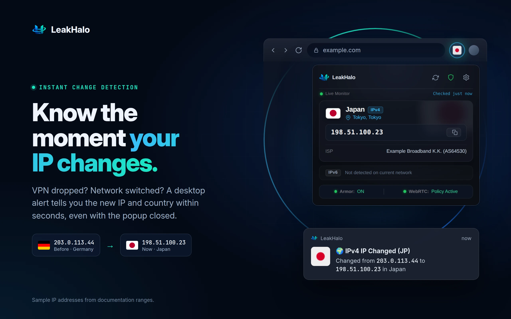
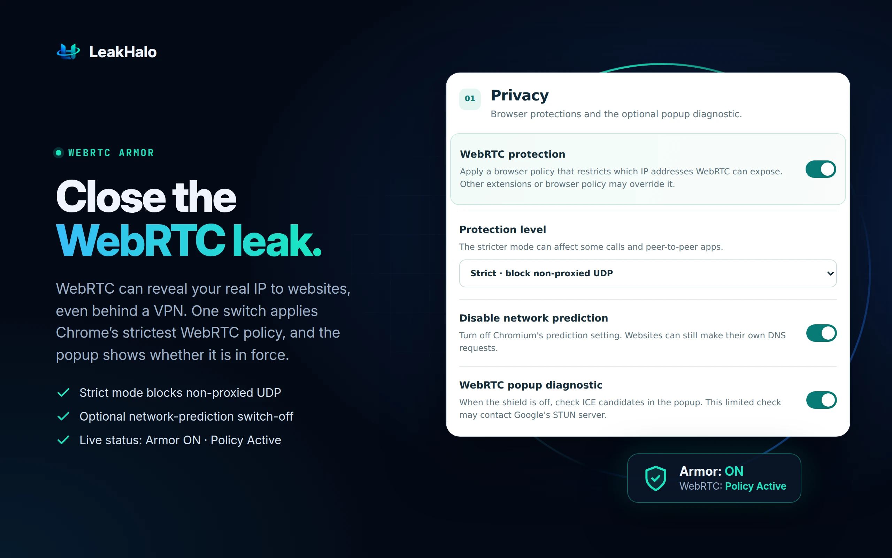
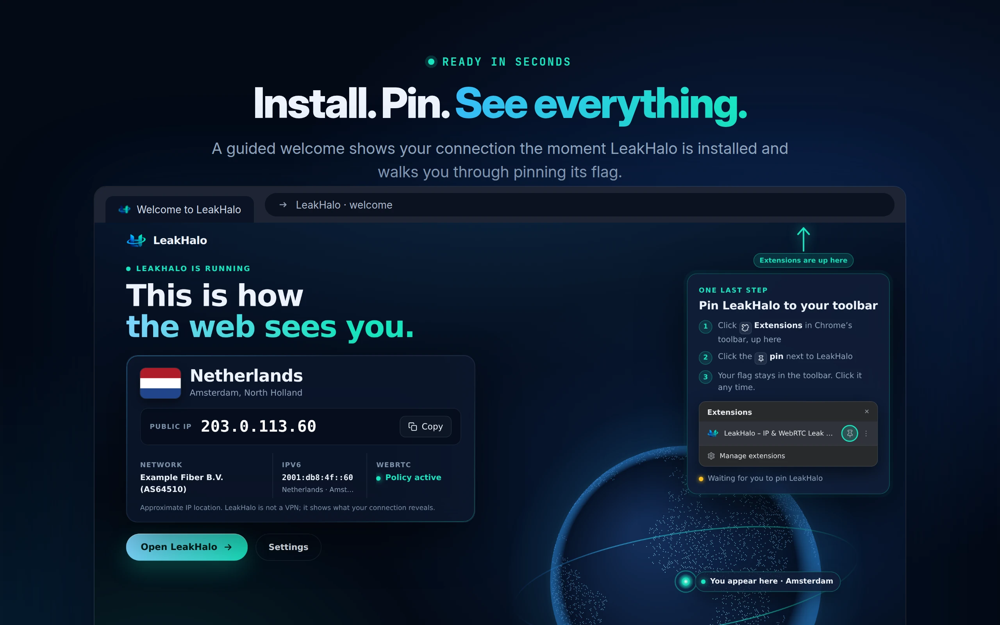
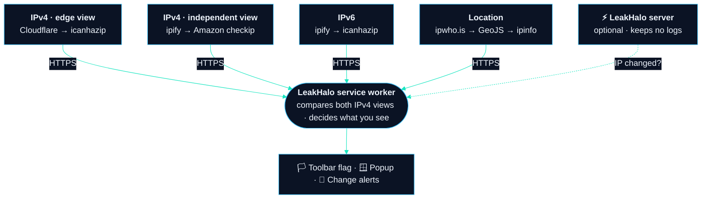

<div align="center">

<a href="https://github.com/SLMN-LABS/leakhalo/releases/latest"></a>

<br>

[](https://github.com/SLMN-LABS/leakhalo/releases/latest)
[](https://github.com/SLMN-LABS/leakhalo/actions/workflows/ci.yml)
[](https://developer.chrome.com/docs/extensions/develop/migrate/what-is-mv3)
[](https://slmn-labs.github.io/leakhalo/privacy.html)
[](LICENSE)

### Your public IP, its country and every leak, one glance away in Chrome’s toolbar.

[**Download 1.0.0**](https://github.com/SLMN-LABS/leakhalo/releases/latest) · [Features](#features) · [How it works](#how-it-works) · [Privacy](#privacy) · [FAQ](#faq) · [Development](#development)

</div>

---

LeakHalo shows the public IP address your browser really connects from, where in the world it appears to be, and whether WebRTC could reveal more than you think. A country flag lives in the toolbar, splits in two when IPv4 and IPv6 take different routes, and a desktop alert tells you within seconds when your IP changes: a VPN that dropped, a network that switched, a proxy rule that stopped applying.

No account. No analytics. No ads. Built by **SLMN LABS**.

## Features

<table>
<tr>
<td width="50%" valign="top">

<h3>🌍 See how the web sees you</h3>
Public <b>IPv4 and IPv6</b> side by side, with country, city and network (ISP and ASN). The country flag stays in the toolbar, so you always know where you appear to be.
</td>
<td width="50%" valign="top">

<h3>🔀 Split routes, caught</h3>
When IPv4 leaves from one country and IPv6 from another, often a VPN that covers only one of them, the flag <b>splits in two</b> and the popup marks the route.
</td>
</tr>
<tr>
<td width="50%" valign="top">

<h3>⚡ Instant change alerts</h3>
A desktop notification with the new IP and country <b>within seconds</b> of a change, even with the popup closed. Each real change is announced once, never spammed.
</td>
<td width="50%" valign="top">

<h3>🛡️ WebRTC Armor</h3>
WebRTC can expose your real IP even behind a VPN. One switch applies Chrome’s <b>WebRTC IP-handling policy</b> (strict mode blocks non-proxied UDP), and the popup shows whether it is in force.
</td>
</tr>
</table>



**Ready in seconds.** On first install a welcome page shows your live connection, guides you through pinning the flag to the toolbar and lets you choose alerts, instant detection and WebRTC Armor in one place.

### And the details that matter

| | |
|---|---|
| 🎯 **Stable answer** | IPv4 is checked from two independent vantage points at once, so the displayed IP and country stay steady even when your network routes some sites differently. An optional warning tells you when that happens. |
| 🧭 **Honest location** | IP geolocation is approximate, and LeakHalo says so. If one location service fails, the next one answers. |
| 🪶 **Light** | No frameworks, no remote code. A background check about every 30 seconds, every 3 seconds while the popup is open. |
| 🎨 **Yours** | Toolbar shows a flag, a flag with a country code, or the plain LeakHalo icon. Map links are optional. |

## Install

**Chrome Web Store:** coming soon.

**Today, from the release:**

1. Download **[LeakHalo-1.0.0.zip](https://github.com/SLMN-LABS/leakhalo/releases/download/v1.0.0/LeakHalo-1.0.0.zip)** and unzip it.
2. Open `chrome://extensions` and turn on **Developer mode** (top right).
3. Click **Load unpacked** and choose the unzipped folder. The welcome page opens.

Built and tested for Google Chrome on desktop. Other Chromium browsers that support Manifest V3 may work.

## How it works



- **Two vantage points for IPv4.** The edge view (Cloudflare) decides what you see. A different route is reported only when the independent view (ipify) keeps disagreeing for at least 15 seconds, and incomplete answers never flip the result.
- **Instant detection.** A tiny WebSocket to LeakHalo’s server reports the IP the server sees; when it differs from the last one, a full check runs immediately. Without it, the 30-second checks still catch every change.
- **Robust by design.** Every request has a timeout, a watchdog ends stuck checks, and a placeholder location is filled in as soon as a location service answers.

## Privacy

LeakHalo keeps your results **only in your browser**. To learn your public IP it contacts the HTTPS services shown above, which receive your IP address as any website does. Nothing is sold, nothing is used for ads, and there is no account to create.

📄 **[Read the full privacy policy](https://slmn-labs.github.io/leakhalo/privacy.html)** ([source](PRIVACY.md))

| Permission | Why LeakHalo needs it |
|---|---|
| `storage` | Your settings and the latest result, stored locally |
| `privacy` | Apply Chrome’s WebRTC IP-handling policy and the network prediction setting |
| `notifications` | The optional alert when your IP changes |
| `alarms` | Background checks about every 30 seconds |
| IP and location services | Discover your public IP and its approximate location |

## FAQ

<details>
<summary><b>Is LeakHalo a VPN?</b></summary>
<br>
No. LeakHalo does not route or encrypt your traffic. It shows what your connection reveals and helps you notice when that changes, which makes it a good companion to a VPN or proxy.
</details>

<details>
<summary><b>Why does it connect to a LeakHalo server?</b></summary>
<br>
For instant detection: the server reports the public IP it sees, so a change is noticed within seconds even while the popup is closed. The server keeps no logs. Turn <b>Instant change detection</b> off in Settings to rely on the 30-second checks only.
</details>

<details>
<summary><b>Why does my flag split in two?</b></summary>
<br>
Your IPv4 and IPv6 traffic leave from different countries. Many VPNs tunnel only IPv4, so sites reachable over IPv6 can still see your real network. The popup shows both addresses so you can tell which is which.
</details>

<details>
<summary><b>Can WebRTC Armor be overridden?</b></summary>
<br>
Yes. Another extension or a managed browser policy can control the same Chrome setting. The popup reports whether Chrome says LeakHalo’s policy is actually in force.
</details>

<details>
<summary><b>How accurate is the location?</b></summary>
<br>
IP geolocation is an estimate from public databases. The country is usually right; the city can be off, especially on mobile networks and VPNs.
</details>

## Development

```sh
npm test                          # static checks and background runtime tests, no install needed
npm install                       # playwright-core, for the browser tests
npx playwright-core install chromium
node test/e2e_browser.cjs         # loads the extension in real Chromium against local provider stand-ins
node test/e2e_browser.cjs --live  # also runs once against the real providers
```

```
background/   service worker: IP checks, routing logic, alerts, WebRTC policy, instant detection
popup/        the toolbar popup
options/      settings page
welcome/      first-install welcome page
assets/       brand, icons and flags
test/         static checks, runtime smoke tests, end-to-end browser tests
```

To package for the store, zip `manifest.json`, `background/`, `popup/`, `options/`, `welcome/`, `assets/`, `privacy.html` and `privacy.css`.

Found a bug or have an idea? [Open an issue](https://github.com/SLMN-LABS/leakhalo/issues). Security problems go privately to the address in [SECURITY.md](SECURITY.md).

## License

Source code and documentation © 2026 SLMN LABS, released under the [MIT License](LICENSE). The license applies to the extension source code and documentation; bundled image assets are excluded and carry their own licenses, listed in [ASSET_ATTRIBUTION.md](ASSET_ATTRIBUTION.md).

<div align="center">
<br>

<br>
<sub>Made by <b>SLMN LABS</b> · <a href="mailto:slmn.labs.official@gmail.com">slmn.labs.official@gmail.com</a></sub>
</div>
